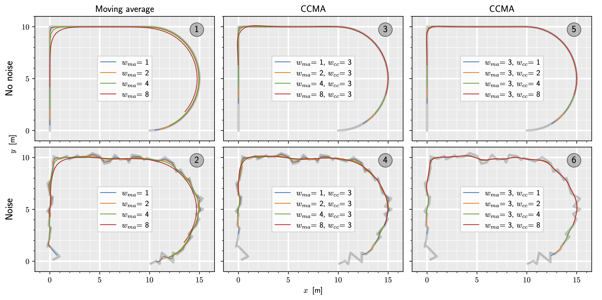

# Curvature Corrected Moving Average (CCMA)


The CCMA is a **model-free**, **general-purpose** smoothing algorithm designed for **2D/3D** paths. It
addresses the phenomenon of the inwards bending phenomenon in curves that commonly occurs with
conventional moving average filters. The CCMA method employs a **symmetric filtering**.
However, due to its symmetric approach, it primarily serves as accurate smoothing rather than state estimation.

The implementation offers a user-friendly experience (see minimal working examle), 
making it remarkably easy to apply filtering to given points represented as a numpy array. 
Users can effortlessly choose from different kernels, including truncated normal, uniform, or the sophisticated Pascal triangle kernel (default).

Furthermore, the implementation provides different boundary behaviors --
padding, wrapping, decreasing filtering width, 
or using no boundary strategy at all. 
This adaptability ensures that the implementation caters to a wide range of scenarios and preferences.

While the code itself may not provide a complete understanding, further details
and insights can be found in the paper:

*T. Steinecker and H.-J. Wuensche, "A Simple and Model-Free Path Filtering
Algorithm for Smoothing and Accuracy", in Proc. IEEE Intelligent Vehicles
Symposium (IV), 2023*



### Minimal Working Example

```python
import numpy as np
from ccma.ccma import CCMA

# Create noisy points on an unit circle
n = 50
noise = np.random.normal(0, 0.05, (n, 2))
points = np.array([np.cos(np.linspace(0, 2*np.pi, n)),
                   np.sin(np.linspace(0, 2*np.pi, n))]).T
noisy_points = points + noise

# Create ccma-object and smooth points by using padding (default) and Pascal's Triangle kernel/weights (default)
ccma = CCMA(w_ma=5, w_cc=3)
points_smoothed = ccma.filter(noisy_points)
```