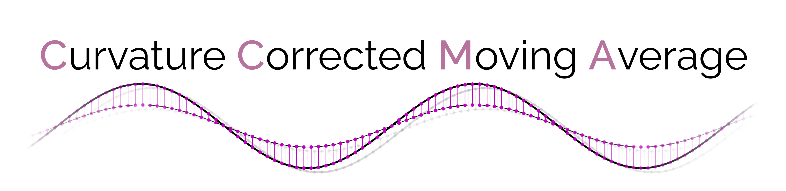
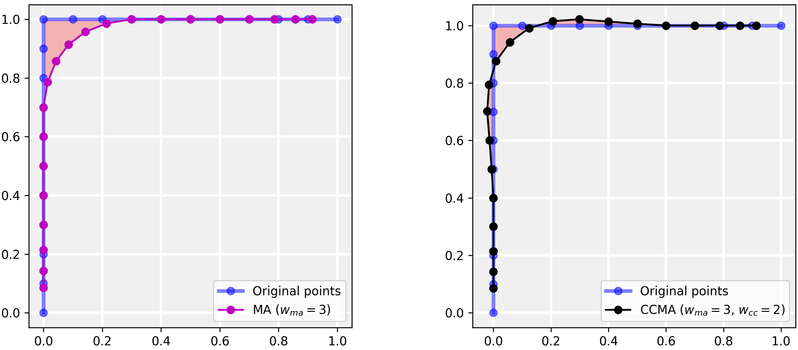
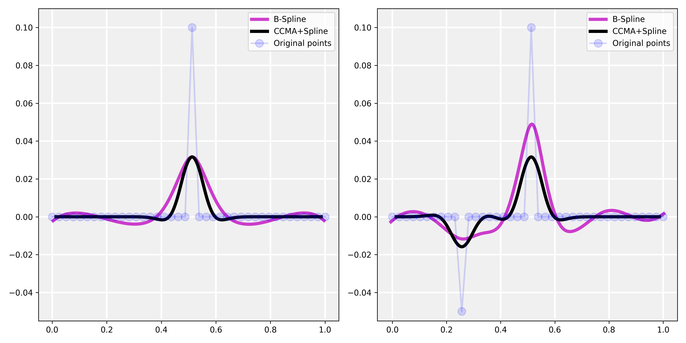
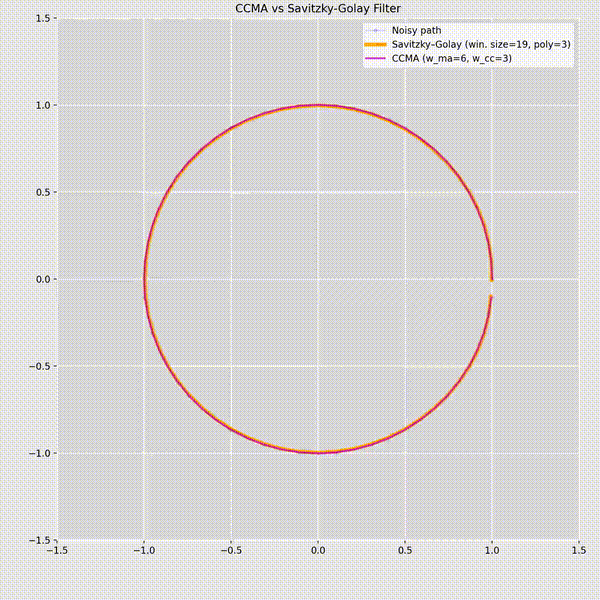

<div  markdown="1" align="center">

  `❞The allure of methods guided solely by data.❞—ChatGPT`

</div>


The Curvature Corrected Moving Average (CCMA) is a **model-free**, **general-purpose** smoothing algorithm designed for **2D/3D** paths. It
addresses the phenomenon of the inwards bending phenomenon in curves that commonly occurs with
conventional moving average filters. The CCMA method employs a **symmetric filtering**.
However, due to its symmetric approach, it primarily serves as accurate smoothing rather than state estimation.

The implementation offers a user-friendly experience (see minimal working examle), 
making it remarkably easy to apply filtering to given points represented as a numpy array. 
Users can effortlessly choose from different kernels, including truncated normal, hanning, 
uniform, or the sophisticated Pascal's triangle kernel (default).

Furthermore, the implementation provides different boundary behaviors—padding, wrapping, decreasing filtering width, 
or using no boundary strategy at all. 
This adaptability ensures that the implementation caters to a wide range of scenarios and preferences.

While the code itself may not provide a complete understanding, further details
and insights can be found in this informative [article](https://medium.com/@steineckertommy/an-accurate-model-free-path-smoothing-algorithm-890fe383d163) or the original [paper](https://ieeexplore.ieee.org/abstract/document/10186704?casa_token=A4esLLLbYm4AAAAA:8gcG8KlNpX7gJkL8EBwkDPNcgBaFPGMbkaRvbJNLbjPrPMT-M61EvUJo27kKlkEkJfxUBnfYpA).

If you use the CCMA, please consider citing the original [paper](https://ieeexplore.ieee.org/abstract/document/10186704?casa_token=sCW2rP_gkSUAAAAA:7MEXKPZzc0XU3YpXb6ayjTlCSrhMYROKe40QmfmABCYxmjoopMwrGztIDzH0F-icaJ6V56P9Aw):

```
@inproceedings{Steinecker23,
  title={A Simple and Model-Free Path Filtering Algorithm for Smoothing and Accuracy},
  author={Steinecker, Thomas and Wuensche, Hans-Joachim},
  booktitle={2023 IEEE Intelligent Vehicles Symposium (IV)},
  pages={1--7},
  year={2023},
  organization={IEEE}
}
```

And if you find this repository useful, I’d greatly appreciate it if you gave it a ⭐ on GitHub — it helps others discover the project and supports further development!


### Quick Links

+ [Minimal Working Example](#minimal-working-example)
+ [Installation](#installation)
+ [HowTo Guide](#howto-guide)
+ [CCMA for Path Interpolation](#ccma-for-path-interpolation)
+ [Splines vs. CCMA](#splines-vs-ccma)
+ [Interactive Example for Better Understanding](#interactive-example-for-better-understanding)
+ [Further Research Ideas](#further-research-ideas)
+ [Star History](#star-history)

### Minimal Working Example

```python
import numpy as np
from ccma import CCMA

# Create noisy points on an unit circle
n = 50
noise = np.random.normal(0, 0.05, (n, 2))
points = np.array([np.cos(np.linspace(0, 2*np.pi, n)),
                   np.sin(np.linspace(0, 2*np.pi, n))]).T
noisy_points = points + noise

# Create ccma-object and smooth points by using padding (default) and Pascal's Triangle kernel/weights (default)
ccma = CCMA(w_ma=5, w_cc=3)
smoothed_points = ccma.filter(noisy_points)
```


### Installation 

To effortlessly install CCMA, utilize the following pip command:

```bash
pip3 install git+https://github.com/UniBwTAS/ccma.git#egg=ccma
```

or

```bash
python3 -m pip install git+https://github.com/UniBwTAS/ccma.git#egg=ccma
```

After a successful installation, ensure the correctness of the setup by following these steps:

1. Open a new terminal window.

2. Launch the Python shell:

    ```python
    python
    ```

3. Verify the installation by importing the CCMA module:

    ```python
    >>> import ccma
    ```


### HowTo Guide

Further information can be found in the [HowTo Guide](./docs/HowTo.md).


### CCMA for Path Interpolation

The CCMA was designed for smoothing noisy paths; 
however, due to its advantageous characteristics and simple usage, 
we believe that it can serve many more applications, 
such as path interpolation. In the figure below, 
it becomes apparent that the CCMA, unlike the MA, 
reduces both overall and maximum errors. 
In the list of provided examples you can find an exemplary implementation of path interpolation.





### Splines vs. CCMA

Splines are commonly chosen for interpolation and smoothing; 
however, local changes may have global impacts, 
leading to unexpected or undesired behavior. 
In contrast, the CCMA is specifically designed to be influenced only by local changes, 
making it a robust and predictable option. 
The figure below illustrates this distinction. 
On the left, it is evident that the CCMA is affected only in the vicinity of the outlier, 
while the P-Spline oscillates over its entire length. 
In the right plot, an additional outlier is introduced, once again affecting the CCMA locally. 
Conversely, the P-Spline undergoes a significant global shape change, 
with the previous peak increasing and the subsequent oscillations becoming more vivid.

Another noteworthy aspect is the possibility of combining the CCMA and B-Splines. 
This results in a continuous function, 
but the output is more predictable and intuitive compared to P-Splines. 
In the figure below, the CCMA was applied first, 
and the outcome was utilized for B-Spline generation. 
An illustrative example can also be found in the list of examples.




### Interactive Example for Better Understanding


The most effective way to learn a new concept is through interaction. 
That's why we've incorporated an [interactive example](./examples/example_interactive.py) 
where you can experiment with different kernels and their parameters. 
Additionally, you have the flexibility to adjust the noise and density of the path. 
Finally, you can zoom in and move around, 
facilitating a more profound understanding. 
We hope you find this tool helpful.


### Savitzky–Golay Filter vs CCMA

The Savitzky–Golay Filter (SGF) is a well-known method for smoothing time-series data. However, when applied to spatial paths, it often exhibits weaker smoothing performance compared to the Curvature-Corrected Moving Average (CCMA).
The video below provides a visual comparison of both approaches. Despite using a comparable window size of 19, the CCMA achieves smoother, more consistent path reconstruction than the SGF.

<p align="center">
  
</p>

### Further Research Ideas

We believe that the CCMA can serve as a foundation for many extensions in similar or unexpected applications, 
as its profound methodology can already impress with good results despite its simplicity. 
In the following, we want to outline a few additional possible research topics related to the CCMA:

+ **Improved Boundary Strategies**
+ **Generalization to Higher-Dimensional Data-Points**
+ **Generalization for Surfaces**
+ **Reformulation for Time-Series Data**
+ **Data-Driven Kernels**

### Star History

[](https://star-history.com/#UniBwTAS/ccma&Date)